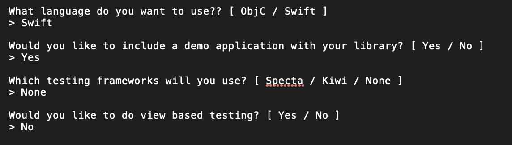
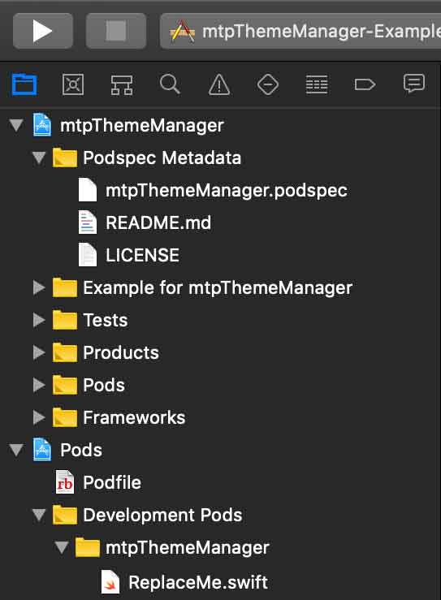
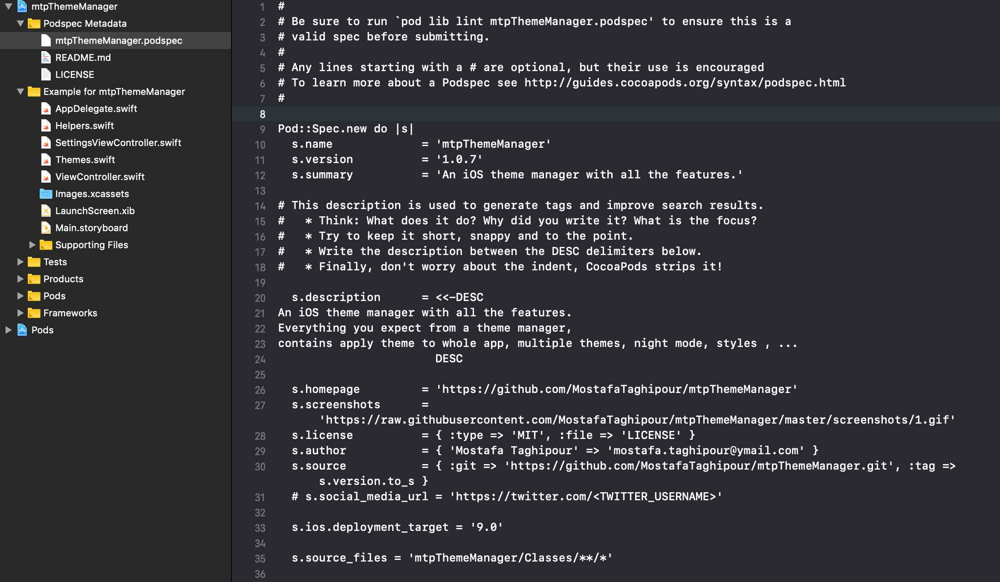

# Create and Distribute iOS Libraries with Cocoapods

In this tutorial, we will show you step by step how to create a library for iOS and distribute it through Cocoapods.

## Create Library
To create a library for iOS and distribute it through Cocoapods, do the following

### Step 1 - Install requirement tools
- Update RubyGems

```
sudo gem update --system
```

- Install CocoaPods in your system

```
sudo gem install cocoapods
```

### Step 2 - Create a Library for CocoaPod
- Create Pod library

Open terminal cd to your specific folder and run:
```
pod lib create {your_library_name}
```
After running the above specified command you will be prompted by an interactive script to select various options for your new Pod project



- Develop your library

After the completion of this command the .workspace project will open up automatically. If it does not, open the .workspace file in the sample project. You will see a ReplaceMe.m (or ReplaceMe.swift) file in the pod target as shown below.



Delete that ReplaceMe file (in {your_project_name}/Classes) and add your own code there with different files {.h|.m} or {.swift}

This is the location where you will put the files [.h,.m,.swift] that you want to share with your pod. You will also see the Podspec Metadata folder as well

Note that you must explicitly label all classes and methods you wish to expose in your library with the public keyword, otherwise, they won't be accessible in other projects.

- prepare a good example project

- Edit the Podspec File

Open the newly generated podspec file. Thankfully Cocoapod has generated a well completed pod spec template for us.

A Podspec file, or Spec, describes a version of a Pod library. It includes details about where the source files are located, which files to use, the build settings to apply, dependencies, frameworks used and other general metadata such as the name, version and description for the Pod.

Below is an example of a Podspec generated by cocoapod:



- Validate podspec with below comment:

```
pod lib lint {your_library_name}.podspec 
```

if you face to swift version error use below comment:

```
echo {your_swift_version} > .swift-version 
```

- Modify Readme file if need

### Step 3 - Create your Pod Repository on Github
- First we’ll need to create an empty Github repository 

- Commit and push the changes on Github 

```
git add .
git commit -m "initial commit"
git remote add origin {your_github_repository_url}
git push -u origin master
```

### Step 4 - Tagging

Tag your most recent commit and push it to the remote, For each release of your project you need to add tag, The name of the tag should match s.version in your .podspec file

```
git tag {version} -m "description"
git push origin {version}
```

### Step 5 - Push your Pod in the Specs Repo
it’s time to deploy it to your private Podspec repository

```
pod trunk push {your_library_name}.podspec
```

if you got “You need to register a session first.” message run:

```
pod trunk register {*your_email_to_session_verification} '{your_name}' --description='{a_short_description_about_you}'
```

verify the session by clicking the link in the verification email and try again run: 

```
pod trunk push {your_library_name}.podspec --verbose
```

- Congratulations! You have just published your first Pod Library


## Update Library
If you modify your library and you want to update Library on Cocoapods, do the following

### Step 1 - Update library version
update s.version in podspec file

### Step 2 - Update your Pod Repository on Github
```
git add .
git commit -m "update"
git push -u origin master
```

### Step 3 - Tagging
The name of the tag should match s.version in your .podspec file

```
git tag {version} -m "description"
git push origin {version}
```

### Step 4 - Push your Pod in the Specs Repo
```
pod trunk push {your_library_name}.podspec
```
